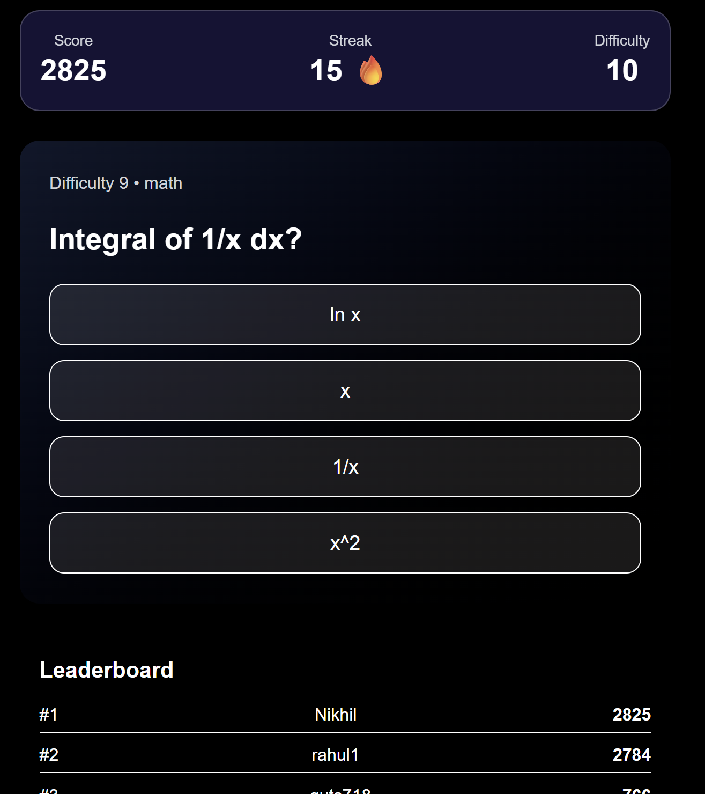

# Adaptive Quiz Platform

## Overview
This project is an adaptive quiz web application that adjusts question difficulty in real time based on user performance. The goal was to build a system that is not only functional but also structured like a real production service. It includes a full backend, database design, caching layer, authentication system, and a responsive frontend.

The platform continuously evaluates answers and updates score, streak, difficulty level, and leaderboard ranking instantly.

---


## Screenshot

### Main Quiz Interface


---


## Features

### Core Quiz Engine
- One question at a time interface
- Adaptive difficulty adjustment
- Streak tracking
- Real‑time score updates
- Non‑repeating recent questions

### Difficulty System
Two difficulty modes are supported:
- Simple momentum based adjustment
- ELO style rating system

The system prevents oscillation and avoids sudden jumps in difficulty.

---

### Leaderboard
- Global score leaderboard
- Streak leaderboard
- Redis sorted set for fast ranking
- Database fallback for reliability

---

### Authentication
- User registration
- Login
- JWT based session handling
- Protected routes
- Logout support

---

### Frontend
- Built with Next.js App Router
- Responsive layout
- Dark and light theme toggle
- Smooth animations
- Live leaderboard refresh

---

### Backend
- Node.js + Express
- PostgreSQL database
- Redis cache layer
- Transaction‑safe answer processing
- Idempotent submission protection

---

## Architecture

Client → API → Services → Database + Cache

Services are separated by responsibility:
- Quiz service
- Score service
- Adaptive engine
- Leaderboard service
- Auth service

Routes never contain logic. They only call services. This keeps the code maintainable and easy to extend.

---

## Database Design

Main tables:
- users
- questions
- user_state
- answers
- leaderboard_snapshots
- idempotency_keys

Hot data such as user state is stored separately from historical answers to keep queries fast.

Indexes are added on difficulty, timestamps, and ranking fields to ensure performance.

---

## Caching Strategy

Redis is used for:
- Leaderboard ranking
- Question pools by difficulty
- Idempotency keys

Reads hit Redis first. If cache is empty, the system falls back to PostgreSQL.

---

## Scoring Rules

- Score increases only on correct answers
- Wrong answers never increase score
- Difficulty and streak increase rewards
- Score cannot decrease below current value

This prevents farming or guessing exploits.

---

## API Endpoints

Auth
- POST /auth/register
- POST /auth/login

Quiz
- GET /quiz/next
- POST /quiz/answer
- GET /quiz/state

Leaderboard
- GET /leaderboard/score
- GET /leaderboard/streak

---

## Running Locally

### Requirements
- Node 18+
- Docker
- npm

---

### Setup

Clone the repository

Install dependencies
```
npm install
```

Start database and cache
```
docker compose up -d
```

Run backend
```
npm run dev
```

Run frontend
```
cd frontend
npm run dev
```

---

## Design Decisions

- Redis used for leaderboard because ranking queries are read heavy
- User state stored separately to avoid scanning answer history
- Transactions used when submitting answers to avoid race conditions
- Idempotency keys prevent duplicate scoring
- Difficulty clamped to prevent extreme jumps

---
